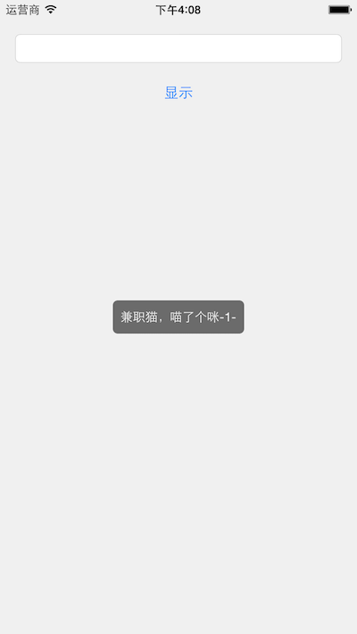
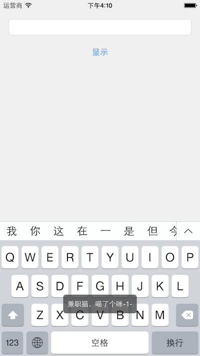
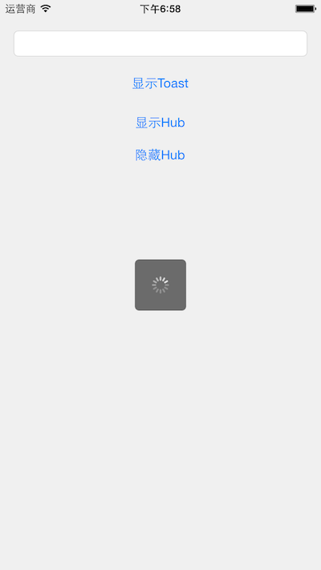
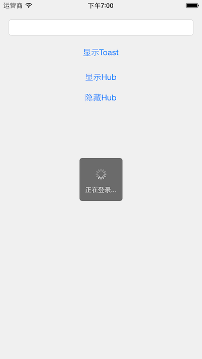

# AJToastHub
1. 基于UIWindow的Toast和加载Hub。
2. 主要解决键盘遮挡Toast的问题。
3. 支持消息队列显示
4. Hub也支持队列显示，如果当前已有一个Hub在显示，一个新的Hub需要显示时，会只显示最新那个Hub。
5. Hub show 了多少次，就需要dismiss相等次数。谁创建了Hub，谁就要负责dismiss。

### 支持3种位置显示
```objective-c
typedef NS_ENUM(NSInteger, ToastPosition)
{
    ToastPositionBottom,
    ToastPositionCenter,
    ToastPositionTop
};

```

### 截图





